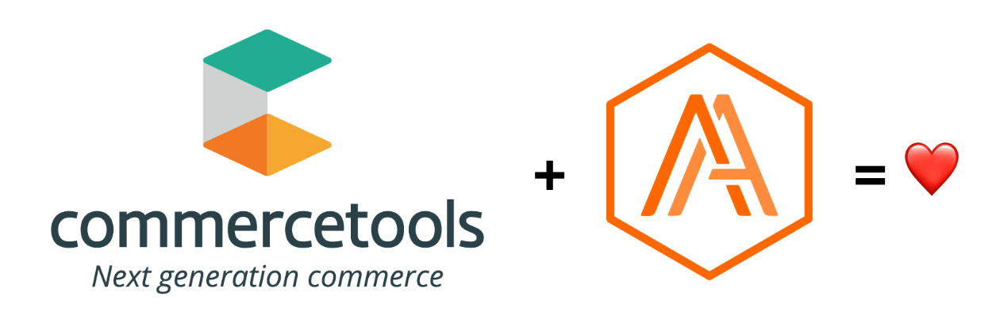

<h1 align=center>CT Backend Engineer Exercise</h1>

  

***
Exercise requirements outlined in [this gist](https://gist.github.com/wrsenn/d0287dd64426d34dc6be4b460b9ab9c3).
***

<h2 align=center>Introduction & Initial Thoughts</h2>

***Hello, commercetools team!*** :smile:

#### Assumptions

From looking at the gist that was provided to me, I've made the following assumptions:

* For the purposes of this exercise, and in the interest of not spending time writing a simple Express endpoint (with logging and such additional baggage that comes along with *Doing It Right*), the application itself should be a simple utility that can be run to generate a report, and does not need to be a web server exposing a REST endpoint.
* The application itself does not need to retrieve, find, or generate Etsy shop IDs, and should simply accept shop IDs as an argument at runtime.
* The application should save each passed shop's listings into a flat file named for the shop in a machine-readable format (JSON).
* The application should output a diff of the listings for each given shop since the last time the application was run with a given shop passed as an argument.
* The list of shop IDs will be passed as an array.
* Only active listings are considered important for each shop.

With those assumptions in mind, it is my understanding that at a high level, the application needs to:

1. Check if a file for each shop already exists.
2. Retrieve the active listings of each shop passed as an argument.
3. If a file for a given shop exists, compare the listings saved in that file to the newly retrieved listings for that shop, returning a difference object.
4. Save the updated listings to a flat file as JSON, overwriting any existing files.
5. Once there are no more shops to retrieve and compare listings for, print the list of differences for each shop to STDOUT.

<h2 align=center>Local Project Setup</h2>

#### Prerequisites:

  * [Node.js >= v12.14.1](https://nodejs.org/en/)
  * Node.js package manager of your choice (NPM or Yarn)

#### Installation:
1. Clone the project to your chosen directory.
2. From the project root directory, run `npm install` or `yarn`.
3. Copy the `.env.example` file at the project's root directory, rename the copy to `.env` and insert your Etsy API key into the environment variable `ETSY_API_KEY`.

That's all that's needed in order to run it locally. You can run it in your terminal with `npm run dev` or `yarn dev`.

> 📝 This application uses `import` syntax instead of commonjs syntax, so the launch script uses babel-node. Likewise, to generate a "production" build, you will need to run the build command `npm run build` or `yarn build` in order to generate a transpiled version of the application. If you decide to build it, you will find the result in the `./dist` directory. You can then run the built application using `node ./dist/index.js`.
